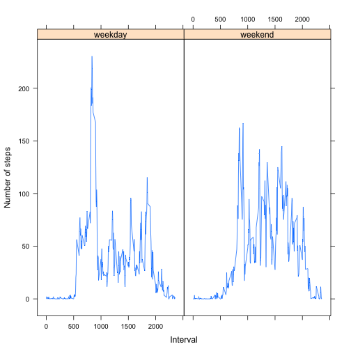

This document was prepared in fulfillment of "Peer Assessment 1" of the Coursera offering "Reproducible Research".  The assignment introduction (copied from the web page) is provided below:

It is now possible to collect a large amount of data about personal movement using activity monitoring devices such as a Fitbit, Nike Fuelband, or Jawbone Up. These type of devices are part of the “quantified self” movement – a group of enthusiasts who take measurements about themselves regularly to improve their health, to find patterns in their behavior, or because they are tech geeks. But these data remain under-utilized both because the raw data are hard to obtain and there is a lack of statistical methods and software for processing and interpreting the data.

This assignment makes use of data from a personal activity monitoring device. This device collects data at 5 minute intervals through out the day. The data consists of two months of data from an anonymous individual collected during the months of October and November, 2012 and include the number of steps taken in 5 minute intervals each day.

Data

The data for this assignment can be downloaded from the course web site:

Dataset: Activity monitoring data [52K]
The variables included in this dataset are:

steps: Number of steps taking in a 5-minute interval (missing values are coded as NA)

date: The date on which the measurement was taken in YYYY-MM-DD format

interval: Identifier for the 5-minute interval in which measurement was taken

The dataset is stored in a comma-separated-value (CSV) file and there are a total of 17,568 observations in this dataset.

## Loading and preprocessing the data

```r
    data <- read.csv('activity.csv')
```
## What is mean total number of steps taken per day?

```r
    means <- aggregate(data$steps, by=list(data$date), FUN=mean, na.rm=TRUE)
    hist(means$x, main='Total Number of Steps Taken Per Day', xlab='Number of Steps')
```

 

```r
    # Calculate daily mean and median.
    daily_mean <- mean(means$x[!is.nan(means$x)])
    daily_median <- median(means$x[!is.nan(means$x)])
```
The daily mean is: 37.3825996.

The daily median is: 37.3784722.

## What is the average daily activity pattern?

```r
    avg_num_steps_taken <- aggregate(data$steps, by=list(data$interval), FUN=mean, na.rm=TRUE)
    plot(unique(data$interval), avg_num_steps_taken$x, type="l", xlab="Interval", ylab="Number of steps taken")
```

 

```r
    # Calculate the interval corresponding to the maximum number of steps.
    max_steps <- max(avg_num_steps_taken$x)
    for (i in 1:length(avg_num_steps_taken$x)) {
        if (max_steps == avg_num_steps_taken$x[i]) {
            max_steps_interval = i
        }
    }
    max_interval <- avg_num_steps_taken$Group.1[max_steps_interval]
```
The interval corresponding to the maximum number of steps is: 835.

## Imputing missing values

```r
    # Calculate the number of missing values.
    num_missing_values <- length(data$steps[!complete.cases(data)])
```
There are 2304 incomplete cases in the original data set.


```r
    # Fill in the missing data with the average value for the corresponding interval.
    missing_indices <- complete.cases(data)
    filled_data <- data

    for (i in 1:length(missing_indices)) {
        if (FALSE == missing_indices[i]) {
            interval <- data$interval[i]
            avg <- avg_num_steps_taken[avg_num_steps_taken$Group.1 == interval, ]
            filled_data$steps[i] = as.integer(avg$x)
        }
    }
    
    filled_means <- aggregate(filled_data$steps, by=list(data$date), FUN=mean)
    
    # Plot the frequency of the total number of steps per day.
    hist(filled_means$x, main='Total Number of Steps Taken Per Day', xlab='Number of Steps')
```

 

```r
    # Calculate the daily mean and median.
    filled_daily_mean <- mean(filled_means$x)
    filled_daily_median <- median(filled_means$x)
```
The daily mean is: 37.3825996.

The daily mean value for the filled data set is: 37.325592.

The daily median is: 37.3784722.

The daily median value for the filled data set is: 36.9479167.

For the given data set, replacing the missing values with the corresponding average value did not significantly effect the mean and median values.

## Are there differences in activity patterns between weekdays and weekends?

```r
    library(lattice)
    factor_date <- function(date) {
        day <- weekdays(as.POSIXlt(date))
        if (day == "Saturday" | day == "Sunday") {
            day_level <- "weekend"
        } else {
            day_level <- "weekday"
        }
        
        day_level
    }

    dates <- as.POSIXlt(unique(filled_data$date))
    week_days <- weekdays(dates)
    day_levels <- factor(sapply(filled_data$date, factor_date), levels=c("weekday", "weekend"))
 
    # What is the average daily activity pattern?
    filled_avg_num_steps_taken <- aggregate(filled_data$steps, by=list(day_levels, filled_data$interval), FUN=mean)
    
    with(filled_avg_num_steps_taken, xyplot(x~Group.2|Group.1, type="l", xlab="Interval", ylab="Number of steps"))
```

 
